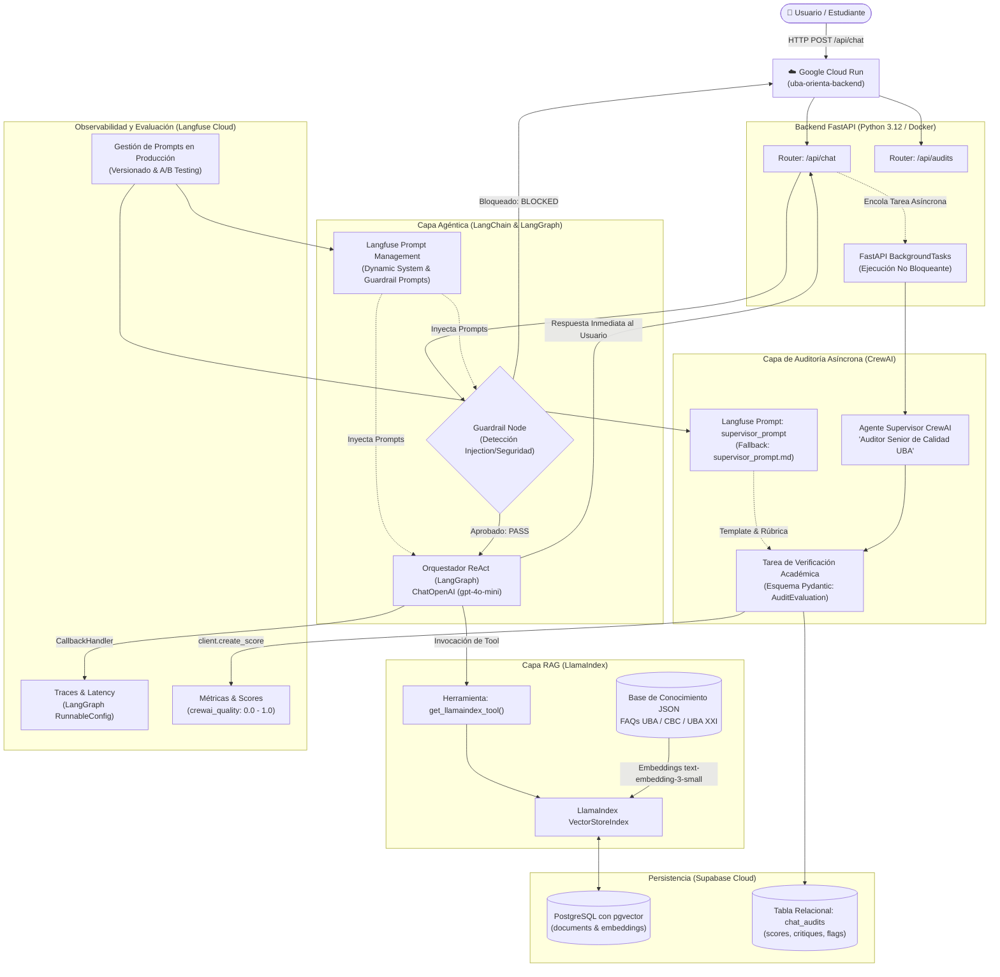
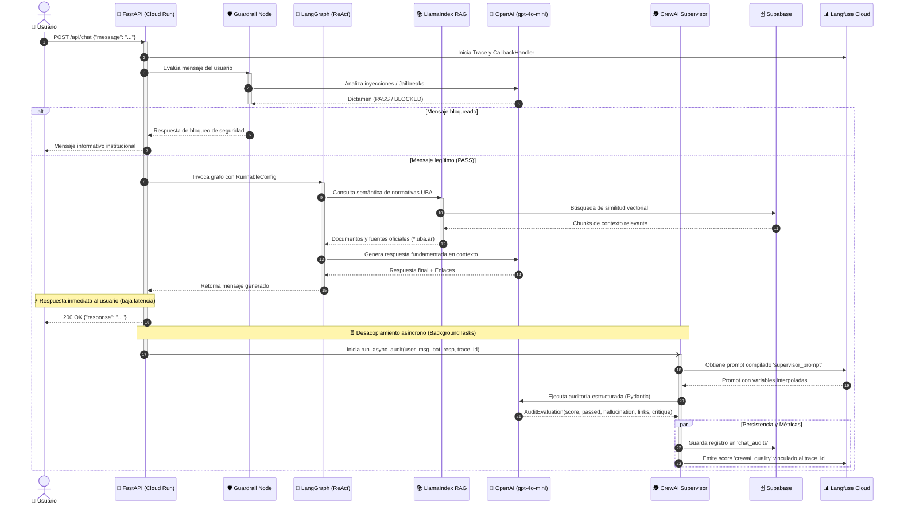
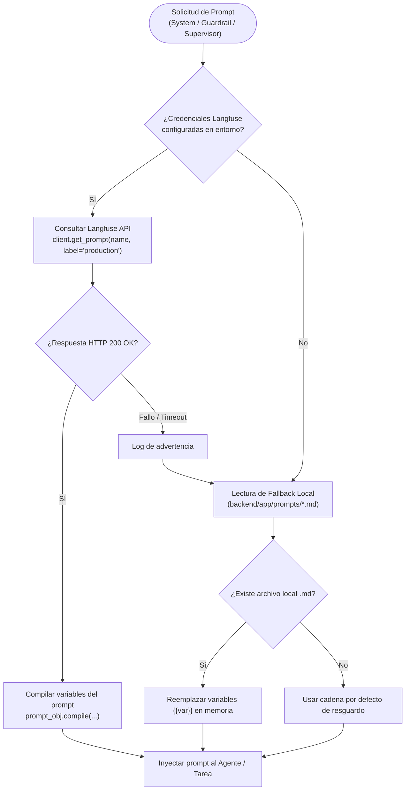

# Arquitectura del Sistema: Agente Inteligente UBA Orienta

**Proyecto de Certificación en AI Engineering**  
**Asistente Institucional de Consultas Frecuentes con Supervisión Continua y Observabilidad**

---

## 📑 Tabla de Contenidos
1. [Resumen Ejecutivo del Sistema](#1-resumen-ejecutivo-del-sistema)
2. [Diagrama de Arquitectura General](#2-diagrama-de-arquitectura-general)
3. [Flujo de Ejecución Secuencial (Sequence Diagram)](#3-flujo-de-ejecución-secuencial)
4. [Arquitectura de Prompts y Resiliencia (Langfuse + Fallback)](#4-arquitectura-de-prompts-y-resiliencia)
5. [Detalle de Capas y Tecnologías](#5-detalle-de-capas-y-tecnologías)
   - [5.1 Capa de Infraestructura y Despliegue](#51-capa-de-infraestructura-y-despliegue)
   - [5.2 Capa de Orquestación Agéntica (LangGraph)](#52-capa-de-orquestación-agéntica-langgraph)
   - [5.3 Capa de Recuperación y RAG (LlamaIndex)](#53-capa-de-recuperación-y-rag-llamaindex)
   - [5.4 Capa de Supervisión y Calidad (CrewAI)](#54-capa-de-supervisión-y-calidad-crewai)
   - [5.5 Capa de Observabilidad y Evaluación (Langfuse)](#55-capa-de-observabilidad-y-evaluación-langfuse)
   - [5.6 Capa de Persistencia y Vectores (Supabase pgvector)](#56-capa-de-persistencia-y-vectores-supabase-pgvector)
6. [Estrategia de Ramas Git para Certificación](#6-estrategia-de-ramas-git-para-certificación)
7. [Apuntes Técnicos para la Defensa Oral frente al Docente](#7-apuntes-técnicos-para-la-defensa-oral)

---

## 1. Resumen Ejecutivo del Sistema

**UBA Orienta** es una solución integral orientada a resolver consultas institucionales y académicas sobre la Universidad de Buenos Aires (UBA). La arquitectura implementa patrones avanzados de **Ingeniería de Inteligencia Artificial**:

- **Patrón ReAct con LangGraph**: Razonamiento y ejecución de herramientas con control de flujo determinista mediante un grafo cíclico con estado.
- **RAG Avanzado con LlamaIndex**: Motor semántico de recuperación de documentos institucionales basado en embeddings vectoriales (`text-embedding-3-small`).
- **Supervisión Asíncrona (LLM-as-a-Judge) con CrewAI**: Tripulación autónoma de agentes auditores que fiscalizan veracidad, dominios oficiales (`*.uba.ar`) y detección de alucinaciones en segundo plano (`BackgroundTasks`), garantizando latencia cero para el usuario.
- **Observabilidad Integral y Prompt Management con Langfuse**: Trazabilidad completa de ejecuciones, sincronización de prompts en producción sin necesidad de redeploy y registro de métricas de calidad.
- **Infraestructura Serverless en Google Cloud Run**: Contenerización bajo Docker con autoescalado y soporte de alta concurrencia.

---

## 2. Diagrama de Arquitectura General

El siguiente diagrama ilustra la relación entre clientes, backend, componentes de IA, bases de datos vectoriales y servicios de observabilidad:



---

## 3. Flujo de Ejecución Secuencial

Este diagrama detalla la interacción temporal entre componentes desde que el usuario envía su pregunta hasta la emisión del score por CrewAI:



---

## 4. Arquitectura de Prompts y Resiliencia

El sistema implementa el principio de **Zero-Downtime Prompt Iteration** mediante Langfuse Prompt Management, respaldado por un mecanismo de tolerancia a fallos offline:



---

## 5. Detalle de Capas y Tecnologías

### 5.1 Capa de Infraestructura y Despliegue
- **Google Cloud Run**: Plataforma PaaS Serverless basada en contenedores Knative.
  - **Ventajas**: Autoescalado desde 0 instancias (reducción drástica de costos), balanceo de carga automático, certificados TLS/HTTPS automáticos y compatibilidad total con Docker OCI.
  - **Script de automatización**: [`scripts/deploy_cloud_run.sh`](file:///home/seba/Escritorio/Repo%20DataPath/scripts/deploy_cloud_run.sh) que valida la sesión con `gcloud`, activa las APIs necesarias (`run`, `cloudbuild`, `artifactregistry`) y compila sin subir secretos.

### 5.2 Capa de Orquestación Agéntica (LangGraph)
- **LangGraph**: Framework de LangChain basado en grafos dirigidos con estado (`StateGraph`).
- **Arquitectura ReAct**: El agente razona (*Thought*), decide qué herramienta invocar (*Action*), observa el resultado del RAG (*Observation*) y elabora la conclusión (*Answer*).
- **Manejo de Estado**: Tipado estricto con `AgentState` propagando mensajes enriquecidos con contexto y metadatos de sesión.

### 5.3 Capa de Recuperación y RAG (LlamaIndex)
- **LlamaIndex (`backend/app/llamaindex_rag.py`)**: Motor especializado en indexación y síntesis de fuentes estructuradas.
- **Base de Conocimiento**: Documentos JSON con normativas oficiales, trámites del CBC, carreras de grado y el programa UBA XXI.
- **Embeddings**: Modelo de OpenAI `text-embedding-3-small` (1536 dimensiones) optimizado para relación costo/precisión.

### 5.4 Capa de Supervisión y Calidad (CrewAI)
- **CrewAI (`backend/app/crewai_monitor.py`)**: Framework multi-agente basado en roles, metas e historias de fondo (*backstories*).
- **Rol del Auditor**: `Auditor Senior de Calidad y Veracidad de Agentes IA (UBA)`.
- **Validación Estricta con Pydantic**:
  ```python
  class AuditEvaluation(BaseModel):
      score: float = Field(description="Calificación de 0.0 a 1.0")
      passed: bool = Field(description="Cumplimiento de estándares de la UBA")
      hallucination_detected: bool = Field(description="Detección de datos inventados")
      official_links_valid: bool = Field(description="Enlaces restringidos a *.uba.ar")
      critique: str = Field(description="Justificación técnica de la evaluación")
  ```

### 5.5 Capa de Observabilidad y Evaluación (Langfuse)
- **Tracing de Observabilidad**: Integración de `CallbackHandler` conectado al ciclo de vida de LangGraph para medir latencias, costo de tokens por petición y árboles de ejecución.
- **Evaluación Automatizada**: Registro de métricas continuas (`crewai_quality`) asociadas a cada `trace_id`.
- **Prompt Management**: Centralización de los prompts (`uba_orienta_system_prompt`, `guardrail_prompt`, `supervisor_prompt`) permitiendo A/B testing y ajustes de rúbrica en caliente.

### 5.6 Capa de Persistencia y Vectores (Supabase pgvector)
- **PostgreSQL + pgvector**: Almacenamiento vectorial relacional bajo el estándar ACID.
- **Historial de Auditorías**: Tabla `chat_audits` para consultar el historial de auditorías mediante la API REST (`GET /api/audits`).

---

## 6. Estrategia de Ramas Git para Certificación

Para responder a las exigencias académicas y demostrar la progresión de la arquitectura, el repositorio se organizó en dos ramas complementarias:

| Rama | Propósito Académico | Componentes Clave |
| :--- | :--- | :--- |
| **`main`** | **Línea Base & Despliegue en GCP** | Dockerfile optimizado, scripts de despliegue en Cloud Run, configuración de puertos y variables de entorno, eliminación de dependencias heredadas. |
| **`dev`** | **Arquitectura Avanzada & Supervisión** | Todo lo de `main` + Motor RAG LlamaIndex + Supervisor CrewAI en segundo plano + Prompts externalizados en Langfuse + Endpoints de auditoría. |

---

## 7. Apuntes Técnicos para la Defensa Oral

Al defender este proyecto frente al docente o jurado evaluador, estos argumentos técnicos fundamentan las decisiones de diseño:

### 1. ¿Por qué desacoplar la auditoría con `BackgroundTasks` en lugar de evaluarlo antes de responder?
> *"Evaluar una respuesta con un segundo LLM (CrewAI) de forma síncrona aumentaría la latencia de respuesta (TTFT y latencia total) en 2 a 4 segundos, perjudicando la experiencia del estudiante. Al utilizar `BackgroundTasks` de FastAPI, el usuario recibe su respuesta inmediatamente (< 1s), mientras que el auditor de CrewAI inspecciona la calidad en segundo plano, persiste la auditoría en Supabase y emite la métrica a Langfuse sin penalizar el rendimiento."*

### 2. ¿Por qué usar LlamaIndex para RAG en lugar de un retriever plano de LangChain?
> *"LlamaIndex está especializado en indexación avanzada, manejo de metadatos jerárquicos y estrategias de síntesis de contexto. En este proyecto se combinó la fortaleza de LangGraph como orquestador de diálogo y control de flujo con la robustez de LlamaIndex como motor de indexación de la base de conocimiento institucional de la UBA."*

### 3. ¿Por qué externalizar los prompts a Langfuse Prompt Management?
> *"Evita el acoplamiento rígido de directivas y lógica de negocio en el código fuente (anti-patrón de hardcoding). Permite modificar la severidad de la auditoría de CrewAI, añadir excepciones de enlaces o ajustar el tono del asistente directamente desde la interfaz web de Langfuse con la etiqueta `production`, surtiendo efecto inmediato sin necesidad de recompilar la imagen Docker ni redeployar en Google Cloud Run."*

### 4. ¿Cómo se garantiza la resiliencia en caso de caída de servicios externos?
> *"El sistema implementa el patrón de degradación elegante (Graceful Degradation):*
> - *Si Langfuse no está disponible, los cargadores de prompts recurren a las plantillas Markdown locales (`prompts/*.md`).*
> - *Si la base de datos Supabase sufre intermitencias, el sistema mantiene las últimas auditorías en un buffer de memoria volátil (`local_audit_buffer`).*
> - *Si la auditoría de CrewAI falla por timeout del modelo, se captura la excepción retornando una evaluación por defecto sin interrumpir el servicio ni generar un código de error 500."*
